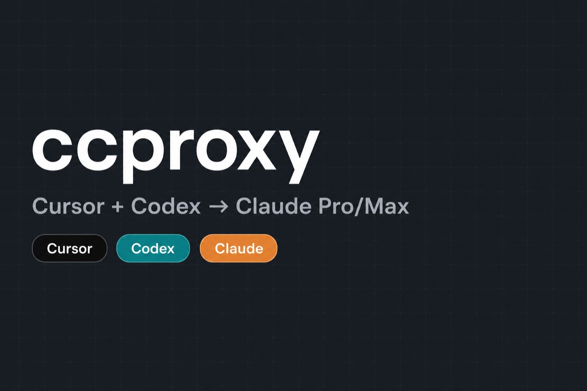

<div align="center">

# ccproxy

### Use Cursor IDE & OpenAI Codex with your Claude Pro / Max subscription

**Self-hosted OpenAI-compatible proxy** for Claude OAuth — no Anthropic pay-per-token API key.
One HTTPS URL powers **Cursor Agent/chat** and **OpenAI Codex** (desktop + CLI).

[](https://github.com/HatriGt/ccproxy/stargazers)
[](https://github.com/HatriGt/ccproxy/fork)
[](./LICENSE)
[](https://github.com/router-for-me/CLIProxyAPI)
[](./docker-compose.yml)
[](https://cursor.com)
[](https://openai.com/codex)
[](https://www.anthropic.com)



```
Cursor  ─┐
         ├─►  https://your-domain/v1  ─►  Claude (your subscription)
Codex   ─┘
```

[Quick start](#quick-start) · [Why ccproxy?](#why-ccproxy) · [Cursor](#how-to-use-claude-in-cursor-ide) · [Codex](#how-to-use-claude-in-openai-codex) · [FAQ](#faq) · [Docs](./docs/README.md)

</div>

---

## Why ccproxy?

Developers search for ways to run **Claude in Cursor** or **Claude in Codex** without burning Anthropic API credits. **ccproxy** is that bridge:

| Need | What ccproxy does |
|------|-------------------|
| Cursor + Claude Pro/Max | OpenAI Base URL override → Claude via OAuth |
| OpenAI Codex + Claude | Responses API (`/v1/responses`) on the same URL |
| Avoid API key bills | Uses your Claude subscription sessions (CLIProxyAPI) |
| Self-hosted control | Docker Compose on your VPS (Traefik / Dokploy ready) |

Built on **[CLIProxyAPI](https://github.com/router-for-me/CLIProxyAPI)** with a small gateway shim so Cursor tool blocks and Codex Responses both work.

---

## Quick start

```bash
git clone https://github.com/HatriGt/ccproxy.git
cd ccproxy
cp .env.example .env          # set your domain and VPS SSH host
./scripts/install-shell.sh    # installs the `ccproxy` CLI + shortcuts
source ~/.zshrc

ccproxy deploy                # build + start the stack on your VPS
ccproxy relogin               # sign in to Claude (one time)
ccu                           # prints the shared OpenAI-compatible base URL
```

Full walkthrough: **[docs/setup-from-scratch.md](./docs/setup-from-scratch.md)**

---

## How to use Claude in Cursor IDE

**Cursor → Settings → Models:**

| Setting | Value |
|---------|-------|
| Override OpenAI Base URL | output of `ccu` (e.g. `https://cliproxy.yourdomain.com/v1`) |
| OpenAI API Key | `dummy` (or your `CLIPROXY_API_KEY`) |
| Anthropic API Key | **Off** |

Reload the window, then pick `ak-claude-sonnet-4.6`, `ak-claude-opus-4.8`, or an effort variant (`…-low` / `…-medium` / `…-high`).

Details: **[docs/cursor-configuration.md](./docs/cursor-configuration.md)**

### Model aliases & effort

```bash
ccproxy models
ccproxy add-model ak-claude-opus-4.9 claude-opus-4-9
ccproxy add-model ak-claude-opus-4.9-low claude-opus-4-9   # auto effort=low
```

Do **not** put `(low)` / `(high)` in the upstream name.

---

## How to use Claude in OpenAI Codex

Same URL as Cursor. Codex uses the **Responses** API; configure a custom provider (desktop + CLI):

```bash
ccproxy codex config                 # print ~/.codex snippet
ccproxy codex helper-model           # map gpt-5.4-mini → Haiku (avoids 502s)
```

Typical provider block (from `ccproxy codex config`):

- `base_url` = same as `ccu`
- `wire_api = "responses"`
- `model` = `ak-claude-opus-4.8` (or another `ak-claude-*` alias)
- `supports_websockets = false`

Guide: **[docs/codex-configuration.md](./docs/codex-configuration.md)**

| Command | Purpose |
|---------|---------|
| `ccproxy codex helper-model [alias]` | Claude model for OpenAI helper side-calls |
| `ccproxy codex helpers` | List OpenAI IDs that get remapped |
| `ccproxy codex config` | Print desktop/CLI config snippet |

---

## Daily ops

| Command | When |
|---------|------|
| `cch` | Health check |
| `ccr` | Claude OAuth re-login |
| `ccu` | Print shared base URL |
| `ccs` / `ccproxy accounts` | Auth + pause status |
| `ccproxy pause` / `resume` | Drop a Claude account from round-robin |
| `cccodex` | Codex subcommands |
| `ccd` | Redeploy |

Daily reference: **[docs/user-guide.md](./docs/user-guide.md)**

---

## Under the hood

```
┌────────────┐
│ Cursor IDE │──┐  HTTPS   ┌─────────────────┐  :8320  ┌──────────────┐  :8318  ┌──────────────┐
└────────────┘  ├─────────►│ Traefik (Dokploy)│────────►│ gateway shim │───────►│ CLIProxyAPI  │──► Claude
┌────────────┐  │          │   your domain    │         │ chat+pass/   │        │ (OAuth)      │
│   Codex    │──┘          └─────────────────┘         │  responses   │        └──────────────┘
└────────────┘                                         └──────────────┘
```

| Component | Responsibility |
|-----------|----------------|
| **[CLIProxyAPI](https://github.com/router-for-me/CLIProxyAPI)** | Claude OAuth, aliases, `/v1/chat/completions` **and** `/v1/responses` |
| **cursor-shim** (gateway) | Cursor tool-block conversion; transparent proxy for Codex `/v1/responses` |
| **Traefik / Dokploy** | TLS → host port `8320` |
| **Docker Compose** | Stack + persistent auth / models / usage volumes |

Deep dive: **[docs/architecture.md](./docs/architecture.md)**

---

## FAQ

### Can I use Claude with Cursor without an Anthropic API key?

Yes. ccproxy authenticates with your **Claude Pro/Max** OAuth session (same family of login as Claude.ai / Claude Code), then exposes an OpenAI-compatible base URL for Cursor’s override.

### Can OpenAI Codex use Claude models?

Yes. Point Codex at the same `base_url`, set `wire_api = "responses"`, and choose an `ak-claude-*` model. Helper OpenAI model IDs (`gpt-5.4-mini`, etc.) are remapped with `ccproxy codex helper-model`.

### Is this the same as Claude Code CLIProxyAPI / cliproxy?

ccproxy **wraps CLIProxyAPI** in Docker with a public HTTPS gateway tuned for Cursor + Codex. Upstream protocol work is [CLIProxyAPI](https://github.com/router-for-me/CLIProxyAPI); this repo adds deploy scripts, the Cursor/Codex gateway shim, aliases, and ops CLI.

### Does Cursor Agent work on localhost?

Usually **no** — Cursor Agent expects a **public HTTPS** URL. Deploy to a VPS (Dokploy/Traefik works well).

### What models are supported?

Whatever your Claude subscription + CLIProxyAPI expose — typically Claude Sonnet and Opus, plus your `ak-claude-*` aliases and effort variants.

---

## Requirements

- A **VPS** with Docker and Docker Compose v2+ (Dokploy + Traefik works well)
- A **domain** A record → VPS
- A **Claude Pro/Max** subscription
- **Cursor** and/or **OpenAI Codex** (desktop or CLI)

---

## Documentation

| Guide | Purpose |
|-------|---------|
| [setup-from-scratch.md](./docs/setup-from-scratch.md) | End-to-end install |
| [user-guide.md](./docs/user-guide.md) | Daily commands |
| [architecture.md](./docs/architecture.md) | Components and flow |
| [cursor-configuration.md](./docs/cursor-configuration.md) | Cursor IDE |
| [codex-configuration.md](./docs/codex-configuration.md) | Codex desktop + CLI |
| [claude-oauth.md](./docs/claude-oauth.md) | Login, accounts, pause |
| [dokploy-traefik.md](./docs/dokploy-traefik.md) | Routing / TLS |
| [operations.md](./docs/operations.md) | Scripts and troubleshooting |
| [environment-variables.md](./docs/environment-variables.md) | `.env` reference |

---

## Repository layout

```
ccproxy/
├── bin/ccproxy            # CLI (ccproxy <command>, including `codex`)
├── packages/cursor-shim/  # Gateway: Cursor format fix + Responses passthrough
├── images/                # Dockerfiles
├── config/                # Model aliases (incl. Codex helper OpenAI IDs)
├── scripts/               # deploy, oauth, codex helper-model, …
├── deploy/                # Traefik / Cloudflare samples
├── docs/                  # Documentation
└── docker-compose.yml
```

---

## Contributing & discovery

If this saves you API spend, a **⭐ star** helps others find Cursor + Codex + Claude setups on GitHub and Google.

Issues and PRs welcome for docs, aliases, and deploy fixes. Keep secrets out of commits (`.env`, `claude-*.json`).

---

## Security

- `.env` and `claude-*.json` are gitignored — never commit credentials.
- Keep `remote-management.allow-remote: false` in `config/config.yaml`.
- Set a strong `CLIPROXY_API_KEY` before exposing the endpoint publicly.
- OAuth tokens grant access to your Claude subscription; treat the VPS accordingly.

---

## License

MIT (this repository). Built on [CLIProxyAPI](https://github.com/router-for-me/CLIProxyAPI) using the [eceasy/cli-proxy-api](https://hub.docker.com/r/eceasy/cli-proxy-api) image. Use in accordance with Anthropic's subscription terms.
